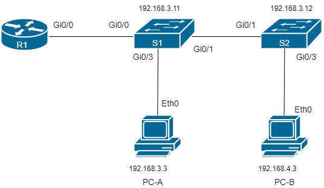
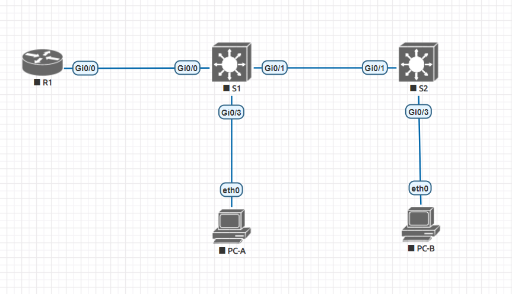

## Настройка маршрутизации между VLAN с использованием "роутера на палочке"
###  Задание:

  1. Создание сети и настройка основных параметров устройств
  2. Создание VLAN и назначение портов коммутаторов;
  3. Настройка магистрали 802.1 Q между коммутаторами;
  4. Настройка маршрутизации между VLAN на маршрутизаторе;
  5. Проверка маршрутизации между VLAN.
###  Решение:
#### 1.1 Топология сети
 Cхема лабораторного стенда, выполненная в draw.io:




Cхема лабораторного стенда, выполненная в eve-ng:



#### 1.2 Настройка основных параметров устройств
#####  Пример настройки на базовых параметров на маршрутизаторе R1:
```
hostname R1
!
  boot-start-marker
  boot-end-marker
!
!
  enable secret 5 $1$k/XQ$C1KMVybBEmx5284xWK4gQ1
!
  aaa new-model
!
!
  aaa authentication login default local
!
!
  aaa session-id common
  ethernet lmi ce
!
!
  clock timezone MSK 3 0
  mmi polling-interval 60
  no mmi auto-configure
  no mmi pvc
  mmi snmp-timeout 180
!
!
  no ip domain lookup
  ip cef
  no ipv6 cef
!
  multilink bundle-name authenticated
!
!
  username cisco privilege 15 secret 9 $9$Bp5GvMPutUfh2I$wsctJDWwH8/BLOC6juhB2Jc45qtYJ/gWy.JwLZ4zii.
!
  redundancy
  ip forward-protocol nd
!
!
  no ip http server
  no ip http secure-server
!
!
!
!
!
!
  control-plane
!
  banner exec ^CAnyone accessing the device that unauthorized access is prohibited^C
  banner incoming ^CAnyone accessing the device that unauthorized access is prohibited^C
  banner login ^CAnyone accessing the device that unauthorized access is prohibited^C
!
  line con 0
  line aux 0
  line vty 0 4
    transport input none
!
  no scheduler allocate
!
  end
```


