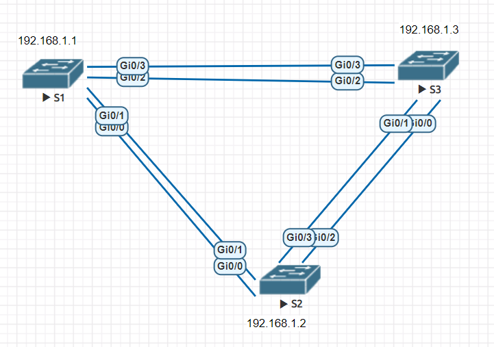
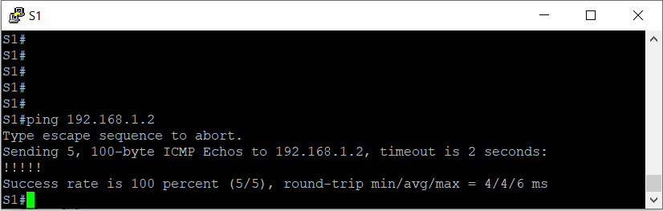
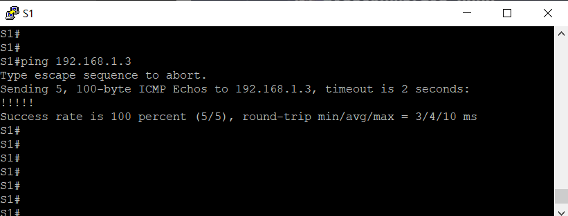
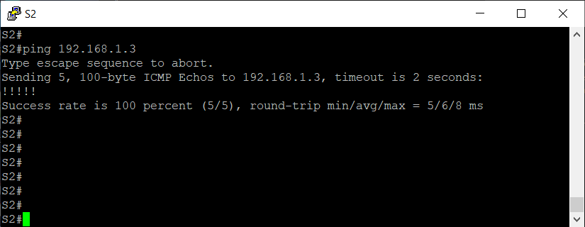
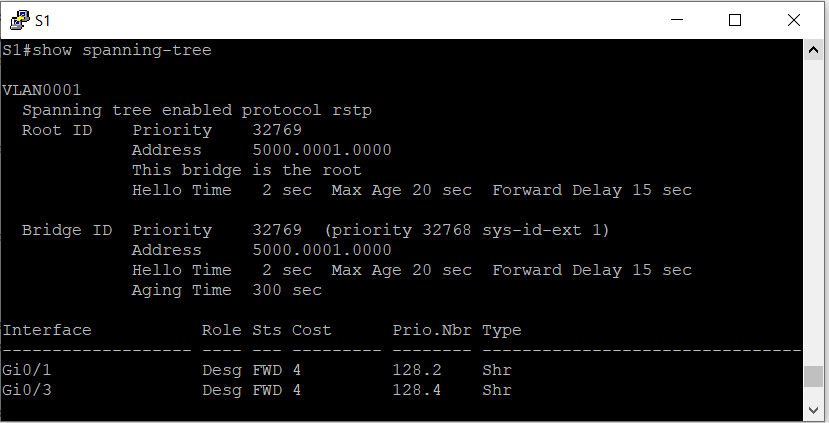
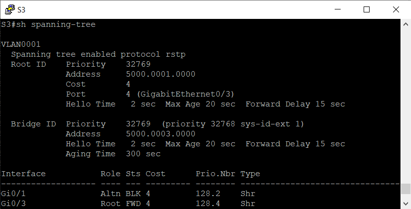
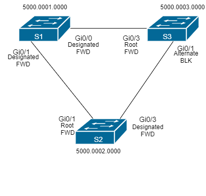

## Развертывание коммутируемой сети с резервными каналами
###  Задание:

  1. Создание сети и настройка основных параметров устройства
  2. Выбор корневого моста;
  3. Наблюдение за процессом выбора протоколом STP порта, исходя из стоимости портов;
  4. Наблюдение за процессом выбора протоколом STP порта, исходя из приоритета портов.
###  Решение:

#### 1 Создание сети и настройка основных параметров устройств
##### 1.1 Топология сети
 
Cхема лабораторного стенда, выполненная в eve-ng:



##### 1.2 Настройка основных параметров устройств
#####  Пример настройки базовых параметров на примере коммутатора S1:
```
hostname S1
!
boot-start-marker
boot-end-marker
!
!
enable secret 5 $1$k/XQ$C1KMVybBEmx5284xWK4gQ1
!
username cisco privilege 15 secret 9 $9$Bp5GvMPutUfh2I$wsctJDWwH8/BLOC6juhB2Jc45qtYJ/gWy.JwLZ4zii.
aaa new-model
!
!
aaa authentication login default local
!
!
!
!
!
!
aaa session-id common
clock timezone MSK 3 0
!
!
!
!
!
!
!
!
no ip domain-lookup
ip cef
no ipv6 cef
!
!
!
spanning-tree mode rapid-pvst
spanning-tree extend system-id
!
vlan internal allocation policy ascending
!
!
!
!
!
!
!
!
!
!
!
!
!
!
interface GigabitEthernet0/0
 media-type rj45
 negotiation auto
!
interface GigabitEthernet0/1
 media-type rj45
 negotiation auto
!
interface GigabitEthernet0/2
 media-type rj45
 negotiation auto
!
interface GigabitEthernet0/3
 media-type rj45
 negotiation auto
!
interface Vlan1
 ip address 192.168.1.1 255.255.255.0
!
ip forward-protocol nd
!
no ip http server
no ip http secure-server
!
!
!
!
!
!
!
!
control-plane
!
banner exec ^CCCAnyone accessing the device that unauthorized access is prohibited^C
banner incoming ^CCCAnyone accessing the device that unauthorized access is prohibited^C
banner login ^CCCAnyone accessing the device that unauthorized access is prohibited^C
!
line con 0
line aux 0
line vty 0 4
!
!
end
```
Аналогично настраиваем коммутаторы S2 и S3
##### 1.3 Проверка доступности устройств
эхо-запрос от коммутатора S1 на коммутатор S2



эхо-запрос от коммутатора S1 на коммутатор S3



эхо-запрос от коммутатора S2 на коммутатор S3



#### 2 Определение корневого моста
##### 2.1 Данные протокола spanning-tree S1



##### 2.2 Данные протокола spanning-tree S2


##### 2.3 Данные протокола spanning-tree S3



##### 2.4 Схема состояний портов коммутатора




Исходя из данных мы видим следующее:
1.
