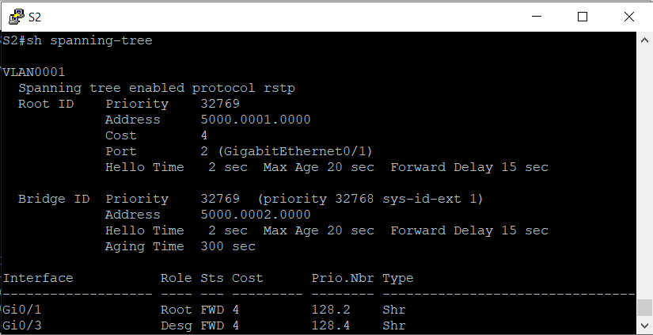

## Развертывание коммутируемой сети с резервными каналами
###  Задание:

  1. Создание сети и настройка основных параметров устройства
  2. Выбор корневого моста;
  3. Наблюдение за процессом выбора протоколом STP порта, исходя из стоимости портов;
  4. Наблюдение за процессом выбора протоколом STP порта, исходя из приоритета портов.
###  Решение:

#### 1 Создание сети и настройка основных параметров устройств
##### 1.1 Топология сети
 
Cхема лабораторного стенда, выполненная в eve-ng:


##### 1.2 Настройка основных параметров устройств
#####  Пример настройки базовых параметров на примере коммутатора S1:
```
hostname S1
!
boot-start-marker
boot-end-marker
!
!
enable secret 5 $1$k/XQ$C1KMVybBEmx5284xWK4gQ1
!
username cisco privilege 15 secret 9 $9$Bp5GvMPutUfh2I$wsctJDWwH8/BLOC6juhB2Jc45qtYJ/gWy.JwLZ4zii.
aaa new-model
!
!
aaa authentication login default local
!
!
!
!
!
!
aaa session-id common
clock timezone MSK 3 0
!
!
!
!
!
!
!
!
no ip domain-lookup
ip cef
no ipv6 cef
!
!
!
spanning-tree mode rapid-pvst
spanning-tree extend system-id
!
vlan internal allocation policy ascending
!
!
!
!
!
!
!
!
!
!
!
!
!
!
interface GigabitEthernet0/0
 media-type rj45
 negotiation auto
!
interface GigabitEthernet0/1
 media-type rj45
 negotiation auto
!
interface GigabitEthernet0/2
 media-type rj45
 negotiation auto
!
interface GigabitEthernet0/3
 media-type rj45
 negotiation auto
!
interface Vlan1
 ip address 192.168.1.1 255.255.255.0
!
ip forward-protocol nd
!
no ip http server
no ip http secure-server
!
!
!
!
!
!
!
!
control-plane
!
banner exec ^CCCAnyone accessing the device that unauthorized access is prohibited^C
banner incoming ^CCCAnyone accessing the device that unauthorized access is prohibited^C
banner login ^CCCAnyone accessing the device that unauthorized access is prohibited^C
!
line con 0
line aux 0
line vty 0 4
!
!
end
```
Аналогично настраиваем коммутаторы S2 и S3
##### 1.3 Проверка доступности устройств
эхо-запрос от коммутатора S1 на коммутатор S2


эхо-запрос от коммутатора S1 на коммутатор S3


эхо-запрос от коммутатора S2 на коммутатор S3


#### 2 Определение корневого моста
##### 2.1 Данные протокола spanning-tree S1


##### 2.2 Данные протокола spanning-tree S2



##### 2.3 Данные протокола spanning-tree S3


##### 2.4 Схема состояний портов коммутатора


##### Исходя из данных мы видим следующее:
1. Коммутатор S1 является корневым мостом, так как имеет наименьший MAC адрес;
2. Порты Gi0/1 коммутатора S2 и Gi0/3 коммутатора S3 являются корневыми, так как смотрят в сторону корневого моста;
3. Порты Gi0/1, Gi0/2 коммутатора S1, Gi 0/3 коммутатора S2 и Gi0/1 коммутатора S3 являются назначенными;
4. Порт Gi0/1 коммутатора S3 заблокирован, так как смотрит в порт с более высокой стоимостью.

#### 3 Наблюдение за процессом выбора протоколом STP порта, исходя из стоимости портов
##### 3.1 Определение коммутатора с заблокированным портом
Выполним команду show spanning-tree на обоих коммутаторах некорневого моста:
```
S2#show spanning-tree

VLAN0001
  Spanning tree enabled protocol rstp
  Root ID    Priority    32769
             Address     5000.0001.0000
             Cost        4
             Port        2 (GigabitEthernet0/1)
             Hello Time   2 sec  Max Age 20 sec  Forward Delay 15 sec

  Bridge ID  Priority    32769  (priority 32768 sys-id-ext 1)
             Address     5000.0002.0000
             Hello Time   2 sec  Max Age 20 sec  Forward Delay 15 sec
             Aging Time  300 sec

Interface           Role Sts Cost      Prio.Nbr Type
------------------- ---- --- --------- -------- --------------------------------
Gi0/1               Root FWD 4         128.2    Shr
Gi0/3               Desg FWD 4         128.4    Shr


S3#show spanning-tree

VLAN0001
  Spanning tree enabled protocol rstp
  Root ID    Priority    32769
             Address     5000.0001.0000
             Cost        4
             Port        4 (GigabitEthernet0/3)
             Hello Time   2 sec  Max Age 20 sec  Forward Delay 15 sec

  Bridge ID  Priority    32769  (priority 32768 sys-id-ext 1)
             Address     5000.0003.0000
             Hello Time   2 sec  Max Age 20 sec  Forward Delay 15 sec
             Aging Time  300 sec

Interface           Role Sts Cost      Prio.Nbr Type
------------------- ---- --- --------- -------- --------------------------------
Gi0/1               Altn BLK 4         128.2    Shr
Gi0/3               Root FWD 4         128.4    Shr
```
##### 3.2 Изменим стоимость порта
#### Уменьшим стоимость порта корневого моста до 2, выполнив команду spanning-tree cost 2 режима конфигурации интерфейса.
```
S3#conf t
Enter configuration commands, one per line.  End with CNTL/Z.
S3(config)#int gi0/3
S3(config-if)#spanning-tree cost 2
```
##### 3.3 Проверка изменения протокола spanning-tree
```
S3#sh spanning-tree

VLAN0001
  Spanning tree enabled protocol rstp
  Root ID    Priority    32769
             Address     5000.0001.0000
             Cost        2
             Port        4 (GigabitEthernet0/3)
             Hello Time   2 sec  Max Age 20 sec  Forward Delay 15 sec

  Bridge ID  Priority    32769  (priority 32768 sys-id-ext 1)
             Address     5000.0003.0000
             Hello Time   2 sec  Max Age 20 sec  Forward Delay 15 sec
             Aging Time  300 sec

Interface           Role Sts Cost      Prio.Nbr Type
------------------- ---- --- --------- -------- --------------------------------
Gi0/1               Desg FWD 4         128.2    Shr
Gi0/3               Root FWD 2         128.4    Shr
```

```
S2#sh spanning-tree

VLAN0001
  Spanning tree enabled protocol rstp
  Root ID    Priority    32769
             Address     5000.0001.0000
             Cost        4
             Port        2 (GigabitEthernet0/1)
             Hello Time   2 sec  Max Age 20 sec  Forward Delay 15 sec

  Bridge ID  Priority    32769  (priority 32768 sys-id-ext 1)
             Address     5000.0002.0000
             Hello Time   2 sec  Max Age 20 sec  Forward Delay 15 sec
             Aging Time  300 sec

Interface           Role Sts Cost      Prio.Nbr Type
------------------- ---- --- --------- -------- --------------------------------
Gi0/1               Root FWD 4         128.2    Shr
Gi0/3               Altn BLK 4         128.4    Shr
```
Как мы видим протокол spanning-tree заменяет ранее заблокированный порт на назначенный порт и блокирует порт, который был назначенным портом на другом коммутаторе. Связанно это с тем что стоимость маршрута через коммутатор S3 уменьшилась.

